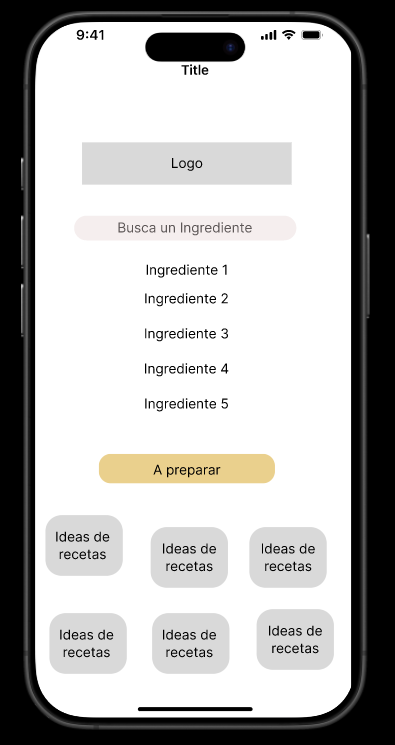
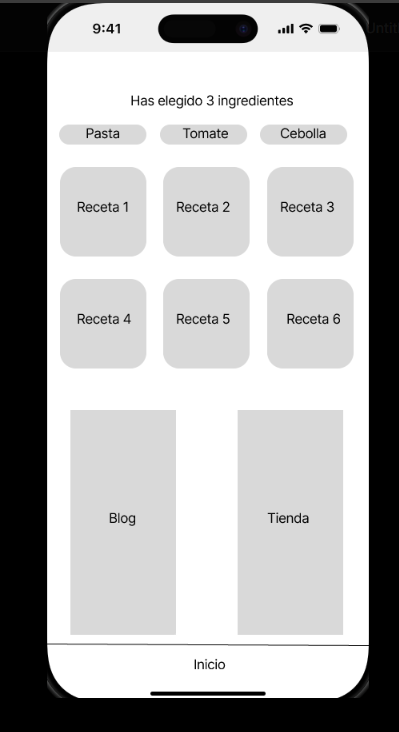

🍳 Generador de Recetas
Una aplicación móvil que sugiere recetas basadas en los ingredientes disponibles en casa.

------------------------------------------------------------------------------------------------------------------------------------------------------------------------------------------------------------

📖 Descripción del Proyecto
El Generador de Recetas es una aplicación móvil para Android diseñada para simplificar la vida en la cocina. Permite a los usuarios ingresar los ingredientes que tienen a mano y obtener recetas sugeridas de manera instantánea. La aplicación está dirigida a cualquier persona que quiera aprovechar al máximo sus ingredientes sin complicaciones, proporcionando opciones rápidas y fáciles de cocinar.

------------------------------------------------------------------------------------------------------------------------------------------------------------------------------------------------------------

🎯 Audiencia Objetivo
Esta app está diseñada para todas las personas que desean mejorar su rutina de cocina, reducir el desperdicio de alimentos y descubrir nuevas recetas utilizando ingredientes ya disponibles.

------------------------------------------------------------------------------------------------------------------------------------------------------------------------------------------------------------

🚀 Características Principales
Sugerencias de Recetas Personalizadas:

Recetas recomendadas en función de los ingredientes ingresados por el usuario.
Filtros para recetas rápidas, económicas o saludables.
Ajuste de porciones para adaptarse a la cantidad de ingredientes disponibles.
Búsqueda de Recetas por Ingredientes:

Los usuarios pueden ingresar una lista de ingredientes y recibir recetas que los utilicen de manera óptima.
Posibilidad de agregar o eliminar ingredientes en la búsqueda para afinar las sugerencias.
Recetas Detalladas:

Descripción completa de la receta con ingredientes, instrucciones de preparación y tiempo estimado de cocción.
Información adicional sobre valor nutricional y calorías.

------------------------------------------------------------------------------------------------------------------------------------------------------------------------------------------------------------

🛠️ Tecnologías Utilizadas
Front End
React Native: Para la creación de una interfaz de usuario fluida y multiplataforma.
Framework7: Para un diseño atractivo y responsivo que mejore la experiencia del usuario.
Back End
Node.js: Para la lógica del servidor y la gestión de las peticiones de API.
Firebase: Para la autenticación de usuarios y almacenamiento de datos de preferencias.
API Integrada
Spoonacular API: Utilizada para obtener recetas en función de los ingredientes disponibles, así como para acceder a información nutricional detallada.

------------------------------------------------------------------------------------------------------------------------------------------------------------------------------------------------------------

📱 Funcionalidades
Interfaz Amigable y Directa: Los usuarios pueden navegar fácilmente por la app, ingresar ingredientes y ver recetas sugeridas de forma sencilla.
Perfiles Personalizados: Los usuarios pueden crear un perfil básico para guardar recetas favoritas y mantener un historial de búsquedas.
Ajuste de Porciones: La app permite ajustar el tamaño de las recetas según la cantidad de ingredientes disponibles.
🛤️ Roadmap de Desarrollo
Fase 1: Configuración de la estructura básica de la app y creación de perfiles de usuario.
Fase 2: Integración de la Spoonacular API para obtener recetas basadas en ingredientes.
Fase 3: Añadir la funcionalidad de ajuste de porciones y filtros de recetas.
Fase 4: Pruebas de usuario y mejoras de interfaz.
Fase 5: Lanzamiento en la Google Play Store.

------------------------------------------------------------------------------------------------------------------------------------------------------------------------------------------------------------

🎨 Wireframe y Diseño de Interfaz
Pantalla Inicial del Usuario:

Búsqueda de Recetas:

------------------------------------------------------------------------------------------------------------------------------------------------------------------------------------------------------------

🏆 Contribuciones
Estamos abiertos a contribuciones. Si tienes ideas para mejorar la app o deseas contribuir al desarrollo, no dudes en crear un pull request o abrir un issue.

🌐 Recursos y Documentación
Documentación de la API de Spoonacular
Documentación de Firebase
Guía de Diseño de React Native
